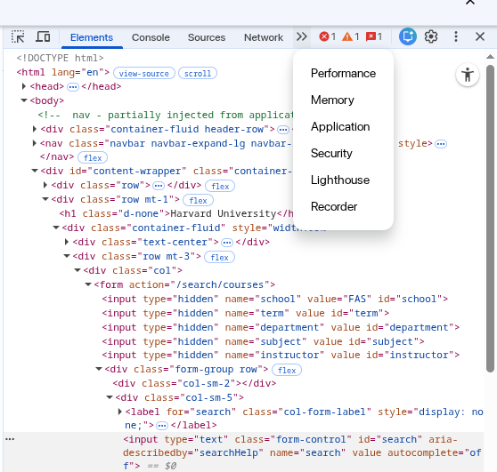
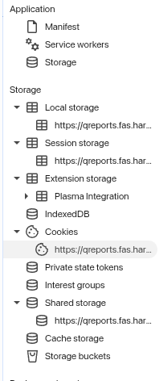

# QGuider

QGuider is a Python library for downloading, parsing, and querying Harvard QGuides — the university's course evaluation reports. It scrapes QGuide HTML pages, normalizes the data into typed Pydantic models, and provides a fluent API for filtering and exporting results.

## Features

- Download QGuides for multiple semesters with checkpointing and resume support
- Parse HTML reports into structured, typed models
- Filter by semester, subject, department, or instructor
- Aggregate multi-instructor courses into a single record
- Export to JSON or pandas DataFrame
- Import previously exported JSON back into model objects

## Installation

```bash
pip install qguider
```

Or install from source:

```bash
git clone https://github.com/ivanharvard/qguider
cd qguider
pip install .
```

## Setup

QGuider requires your Harvard Key credentials to access the QGuide portal. 

1. Login to [Harvard QGuide Portal](https://qreports.fas.harvard.edu/browse/index).
2. Either (press F12 on your keyboard) or (right click anywhere on the page, and click `Inspect`).
3. Press the arrow pointing to the right, and then click on `Application`.

4. Under Storage, find Cookies, and under Cookies, find the option that looks like `https://qreports.fas.har...`

5. Find the row that's labeled `SESSION`. In that row, double click the cell under the column `Value`. Copy it to your clipboard.
6. Create a `.env` file in your working directory if it does not already exist:
```
SESSION="..."
```
7. Paste the value into your `.env`.
8. When initializing the `QGuider`, pass in the path to your `.env` file.

This `SESSION` key is temporary! You will need to replace it every 30-40 minutes or so if you wish to download any sources. You'll know it's time to replace it when you get 0 QGuide listings when attempting to download QGuides.

## Quick Start

```python
import qguider

qgdr = qguider.QGuider(creds=".env")

results = (
    qgdr.query()
    .semesters("Fall 2024", "Spring 2025")
    .download(checkpoint=True, checkpoint_interval=15)
    .parse()
    .agg(by="id") # all courses with the same id will be merged
)

qguider.exporter.to_json(results, "qguider_data/output.json")
```

## API Reference

### `QGuider`

The top-level entry point.

```python
qgdr = qguider.QGuider(creds=".env", outpath="qguider_data")
query = qgdr.query()
```

- `creds` — path to a `.env` file containing credentials
- `outpath` — directory where downloaded HTML files are stored (default: `qguider_data`)

### `Query` (fluent builder)

Chain filters before downloading:

| Method | Description |
|---|---|
| `.semesters("Fall 2024", ...)` | Filter by one or more semesters |
| `.subjects("CS", "MATH", ...)` | Filter by subject code |
| `.departments("Computer Science", ...)` | Filter by department name |
| `.instructor_last_name("Smith")` | Filter by instructor last name |
| `.search("algorithms")` | Free-text search |
| `.progress(rich_progress)` | Attach a Rich progress bar |
| `.outpath("path/")` | Override output directory |

After setting filters, call:

```python
# Download HTML files to disk
.download(checkpoint=True, checkpoint_interval=15, report_failed=True)

# Parse previously downloaded files
.parse(skip_failed=True)

# Download and parse in one step
.run(checkpoint=True, skip_failed=True)
```

### `QGuideSet`

`download().parse()` returns a `QGuideSet`, a list-like container of `QGuide` objects.

```python
len(results)          # number of QGuides
results[0]            # access by index
for guide in results: # iterate
    print(guide.course.title)

# Merge entries that share the same QGuide ID (e.g., multi-instructor courses)
merged = results.agg(by="id")
```

### Data Models

Each `QGuide` contains:

| Field | Type | Description |
|---|---|---|
| `id` | `str` | Unique QGuide identifier |
| `course` | `Course` | Course metadata |
| `response_rate` | `ResponseRate` | Survey response counts and ratio |
| `course_feedback` | `CourseFeedback` | Likert ratings for overall course, materials, assignments, etc. |
| `instructor_feedback` | `list[InstructorFeedback]` | Per-instructor Likert ratings |
| `hours_per_week` | `HoursPerWeek` | Reported weekly workload distribution |
| `recommendation_strength` | `RecommendationStrength` | How strongly students recommend the course |
| `reasons_for_enrollment` | `ReasonsForEnrollment` | Distribution of enrollment motivations |
| `comments` | `list[Comment]` | Free-text student comments |

`Course` fields: `title`, `subject`, `department`, `number`, `section`, `instructors`, `semester`, `aliases`.

### Exporting

```python
# Write to JSON file
qguider.exporter.to_json(results, "output.json")

# Return JSON string without writing
json_str = qguider.exporter.to_json(results)

# Convert to pandas DataFrame (requires pandas)
df = qguider.exporter.to_dataframe(results)
```

### Importing

```python
results = qguider.importer.from_json("output.json")
```

## CLI Example

A reference CLI is provided in [`examples/cli.py`](examples/cli.py):

```bash
# Download and parse all semesters, write JSON
python -m examples.cli --download

# Download with Rich progress bar
python -m examples.cli --download --progress

# Parse previously downloaded HTML files
python -m examples.cli --parse

# Import from a previously exported JSON
python -m examples.cli --import

# Skip aggregation of multi-instructor courses
python -m examples.cli --download --no-agg

# Set logging verbosity
python -m examples.cli --download --log-level DEBUG

# Clear all downloaded data
python -m examples.cli --clear-all
```

## Supported Semesters

QGuider currently supports FAS (Faculty of Arts and Sciences) evaluations for:

- Fall 2023
- Spring 2024
- Fall 2024
- Spring 2025
- Fall 2025
- Spring 2026

## Notes

- Downloaded HTML files are cached under `qguider_data/` by semester, department, and subject — re-running a download with `checkpoint=True` skips already-downloaded files.
- `agg(by="id")` merges records that share a QGuide ID, deduplicating instructor feedback and comments across entries for the same course offering.
